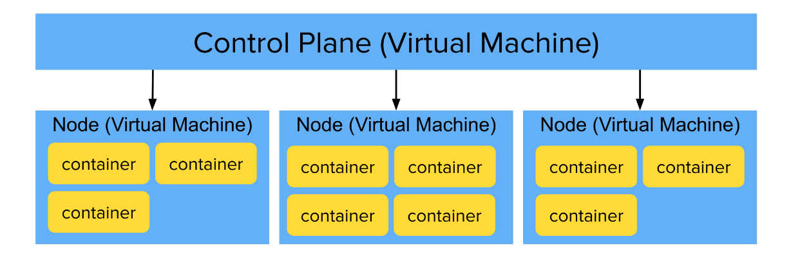

<h1>
  Intro to Kubernetes
  How does Kubernetes work?
</h1>

**Learning objective:** By the end of this lesson, students will be able to explain the basics of how Kubernetes organizes, manages, and scales containerized applications.

## How does Kubernetes work?

At its core, Kubernetes is a powerful system installed on a group of Linux servers to help manage containerized applications. When several servers are connected and configured together, they form a **Kubernetes cluster**. Each server in this cluster has its own Linux operating system (like Red Hat, CoreOS, or Ubuntu) and runs Kubernetes as an additional layer on top. This setup allows Kubernetes to orchestrate containers across multiple servers easily.

Some servers in the cluster have specific roles, such as **managing and scheduling containers** or **serving as the API hub** for Kubernetes. Together, these servers make up what’s called the **_control plane_**. To ensure high availability, the control plane usually consists of more than one server, which synchronizes information using a distributed database called [etcd](https://etcd.io/).

 

 

The remaining servers in the cluster, known as **_nodes_**, do the actual work of running your containers. The control plane assigns containers to these nodes, which can be either virtual or physical machines.

> There are now [operating systems](https://www.suse.com/c/rancher_blog/announcing-k3os-a-kubernetes-operating-system/) specifically designed for Kubernetes, which can streamline installation and management even further for specialized setups.

## Kubernetes is declarative

One of Kubernetes' biggest strengths is that it’s **_declarative_**. This means you only need to tell Kubernetes what you want (your desired state), and it will automatically make that happen. You don’t need to manually monitor and adjust the system constantly—Kubernetes takes care of it.

### Example: Declarative scaling with Kubernetes

Imagine you have **3** containers running your app, but you suddenly need more due to an increase in traffic. Instead of telling Kubernetes to add **7** more containers, you simply declare that you want a total of **10** containers. Kubernetes will recognize that **3** are already running, and it will add the remaining **7** to reach your desired total. It's a subtle thing, but it makes a big difference when managing a large cluster.

### Kubernetes keeps your cluster running smoothly

Kubernetes works constantly to make sure the cluster matches your desired state. Here are some examples:

- If a container crashes, Kubernetes restarts it automatically.
- If a container becomes unresponsive, Kubernetes removes it and starts a new one.
- When scaling up, Kubernetes adds containers to reach the desired total.
- When scaling down, Kubernetes removes extra containers to match your target count.
- If a new node is added to your cluster, Kubernetes will start containers on that node as needed.
- If a node goes down, Kubernetes will replace the lost containers on other nodes (if capacity allows).

All of this happens automatically, without any manual intervention from you. This _self-healing_ ability simplifies cluster management, as you only need to specify what you want to achieve, and Kubernetes handles the rest behind the scenes.

## Kubernetes and container runtimes

While **Docker** is commonly used with Kubernetes, it’s not the only option. [Kubernetes supports several container runtimes](https://kubernetes.io/docs/concepts/containers/), each of which can run containers in the cluster.

Some popular choices include:

- [Docker](https://docs.docker.com/engine/)
- [containerd](https://containerd.io/docs/)
- [CRI-O](https://cri-o.io/#what-is-cri-o)
- [Kubernetes CRI (Container Runtime Interface)](https://github.com/kubernetes/community/blob/master/contributors/devel/sig-node/container-runtime-interface.md).

You can choose the container runtime that best fits your setup, but Kubernetes will operate consistently across them.
