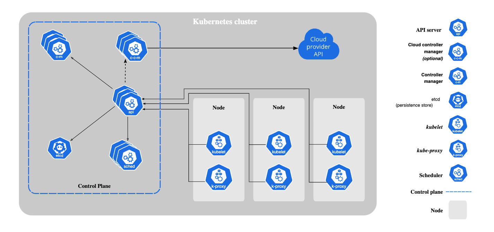

<h1>
  Intro to Kubernetes
  Kubernetes Terminology
</h1>

**Learning objective:** By the end of this lesson, students will be able to define and describe essential Kubernetes terms.

 

[source](https://kubernetes.io/docs/concepts/overview/components/)

 

## Terminology

Understanding Kubernetes starts with getting familiar with its key terms. Here’s a breakdown of the most important concepts:

### Cluster

A **_cluster_** is a set of working machines (called nodes) that Kubernetes manages. It must have at least one worker node to be considered a cluster. The cluster is what provides the environment for deploying and running applications at scale.

### Node

A **_node_** is a single machine, either physical or virtual, within a Kubernetes cluster. Nodes are responsible for running applications in the form of containers. Most of the workload happens here, as containers are deployed on nodes to perform tasks.

### Control Plane

The **_control plane_** is a set of machines responsible for managing the cluster itself. These machines monitor the health of nodes, schedule workloads, and maintain the desired state of the cluster. The control plane typically includes the **Kubernetes API server**, which allows for remote management and coordination of nodes. The control plane often has multiple replicas for reliability and redundancy.

### Kubelet

**_Kubelet_** is an agent that runs on each node in the cluster. It communicates with the control plane and ensures that the containers on its node are running as expected. Kubelet listens for instructions from the control plane and manages the lifecycle of containers on the node it resides on.

### Service

A **_service_** is a component in Kubernetes that acts as both a load balancer and a DNS entry for a group of pods. It routes traffic to the appropriate pods, whether the request comes from outside the cluster or from other services within the cluster. The service automatically keeps track of all pods registered to it, distributing requests evenly to avoid overloading any single pod.

### Pod

A **_pod_** is the smallest unit of deployment in Kubernetes. Rather than managing individual containers, Kubernetes manages pods, which are groups of one or more containers running together on the same node. A pod usually contains a single container, but it can have multiple if the containers need to work closely together (a common design pattern known as the [sidecar container pattern](https://www.oreilly.com/library/view/designing-distributed-systems/9781491983638/ch02.html)).

A pod is considered "ready" when all of its containers are running properly. If one container in a pod fails and is removed, the whole pod may be terminated and replaced, ensuring the cluster remains healthy.

### Deployment

A **_deployment_** is a way to define and manage the desired state of a set of pods. Underneath, it uses a [ReplicaSet](https://kubernetes.io/docs/concepts/workloads/controllers/replicaset/) to make sure the specified number of pod instances is always running. For example, if you set up a deployment with 3 pods, the deployment will automatically ensure that 3 pods are running at all times, even if some fail and need restarting.

### Namespace

A **_namespace_** allows for logical grouping of resources within a cluster. By organizing resources (like pods and services) into namespaces, you can isolate different environments or applications, making it easier to manage resources within large clusters.
