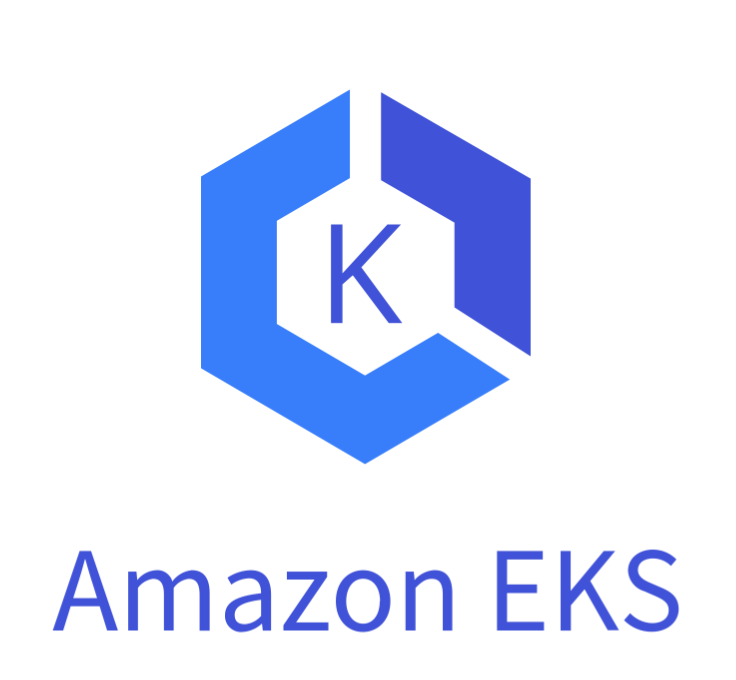
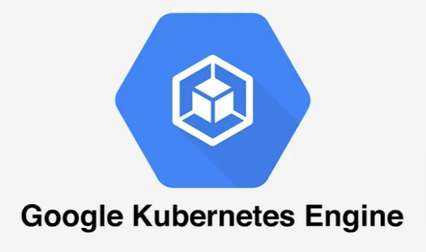
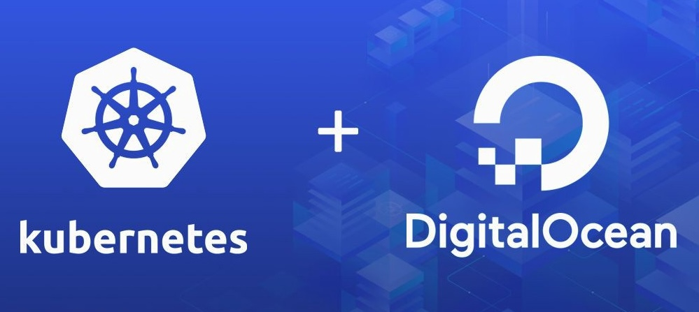
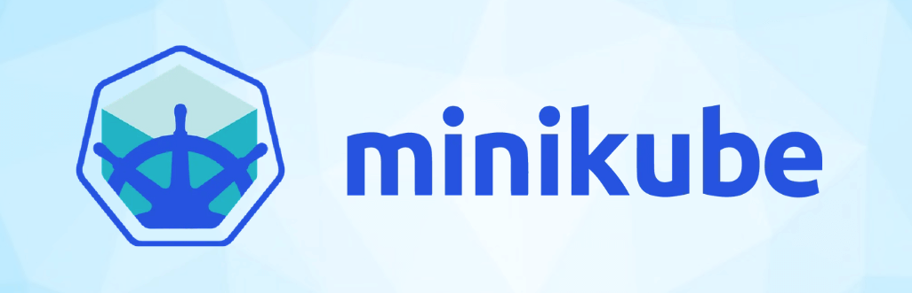

<h1>
  Intro to Kubernetes
  Managed vs Unmanaged Kubernetes
</h1>

**Learning Objective:**  
By the end of this lesson, students will be able to distinguish between managed and unmanaged Kubernetes environments and understand the role of tools like Minikube in Kubernetes development.

## Managed vs. Unmanaged Kubernetes

One of the things that most people discover when starting to work with Kubernetes is just how complex the system is. Kubernetes is a powerful tool with many intricate features, which can feel overwhelming for beginners.

In fact, many companies that use Kubernetes rely on dedicated specialists whose primary responsibility is to manage their Kubernetes clusters. It requires significant training to become comfortable with managing a cluster on the scale that most companies require.

## Managed Kubernetes services

For those starting out—or even for experienced teams—using a **managed Kubernetes service** can simplify many of the challenges associated with setting up and maintaining a cluster. These services are offered by major cloud providers and come pre-configured, removing many of the initial hurdles.

Popular managed Kubernetes services include:

| Service                                                                                                      | Link                                                                         |
| ------------------------------------------------------------------------------------------------------------ | ---------------------------------------------------------------------------- |
|                               | [Amazon Elastic Kubernetes Service (EKS)](https://aws.amazon.com/eks/)       |
|                 | [Google Kubernetes Engine (GKE)](https://cloud.google.com/kubernetes-engine) |
|  | [DigitalOcean Kubernetes](https://www.digitalocean.com/products/kubernetes/) |

Using a managed service can save time and effort, especially when you're new to Kubernetes, by handling tasks like cluster setup, scaling, and maintenance.

## Unmanaged Kubernetes clusters

In an unmanaged Kubernetes setup, you are responsible for installing, configuring, and maintaining the entire Kubernetes environment. While this provides full control and customization, it also requires significant expertise and effort.

Unmanaged clusters are typically used by organizations with complex, specific requirements or teams with advanced Kubernetes knowledge.

## Minikube: A local Kubernetes option

For local development, [**Minikube**](https://minikube.sigs.k8s.io/docs/) is a great tool to simulate a Kubernetes environment. Minikube is a lightweight, single-node Kubernetes cluster that runs on your local machine. It's supported on Windows, Linux, and macOS.

### Why use Minikube?

Minikube enables developers to:

- Build and test Kubernetes applications locally without needing access to a full production cluster.
- Experiment with Kubernetes features in a low-risk environment.

It provides a convenient way to practice Kubernetes concepts and simulate the experience of working with a real cluster.
