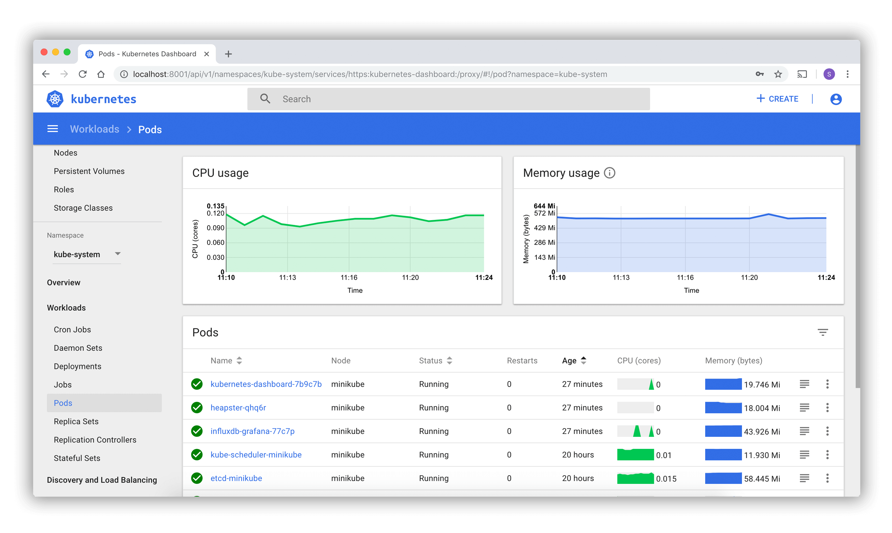

<h1>
  <span class="headline">Intro to Kubernetes</span>
  <span class="subhead">Managing Kubernetes Clusters with <code>kubectl</code></span>
</h1>

**Learning objective:** By the end of this lesson, students will be able to explain how Kubernetes clusters are managed using the kubectl command-line tool.

## Managing Kubernetes Clusters with kubectl

In Kubernetes, the main way to interact with and manage your cluster is through its API. We don’t usually make requests directly to the API. Instead, we use the command-line tool **kubectl** to interact with the cluster.

**kubectl** is a command-line tool that allows you to make requests to a Kubernetes cluster. Most tasks can be completed using simple commands and parameters. For more advanced tasks, such as defining services and deployments that we might want to track in version control, we use YAML or JSON files.

These files define Kubernetes objects, and we can upload them using the `kubectl apply` command.

## Example: Adding a new service

Let’s say you have a file named `service.yml` that defines a new service. To create that service in your cluster, you would run:

```bash
kubectl apply -f service.yml           ***Example Only***
```

This command will read the `service.yml` file, create the Kubernetes object defined in it, and update the cluster’s state accordingly. In this case, a new service will be added to the cluster.

Here’s an example of a `YAML` file that defines a Kubernetes deployment object:

```yaml
apiVersion: apps/v1
kind: Deployment
metadata:
  name: nginx-deployment
spec:
  selector:
    matchLabels:
      app: nginx
  replicas: 2 # Deploy 2 pods with this template
  template:
    metadata:
      labels:
        app: nginx
    spec:
      containers:
        - name: nginx
          image: nginx:1.14.2
          ports:
            - containerPort: 80
```

For more details on Kubernetes objects, check out the [Kubernetes objects documentation](https://kubernetes.io/docs/concepts/overview/working-with-objects/kubernetes-objects/)

## Does Kubernetes have a front-end?

Kubernetes does not have a typical front-end user interface (UI). It does offer a [read-only dashboard](https://kubernetes.io/docs/tasks/access-application-cluster/web-ui-dashboard/), which is useful for viewing cluster data, but you can only perform a limited number of tasks through it. Most management tasks are done using the `kubectl` command-line tool.



[source](https://kubernetes.io/docs/tasks/access-application-cluster/web-ui-dashboard/)
